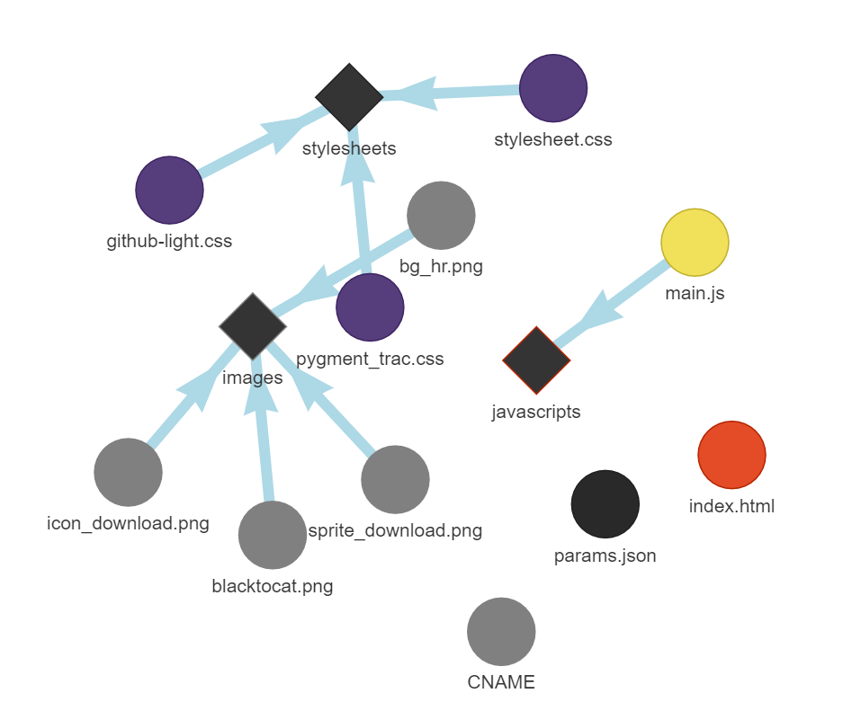
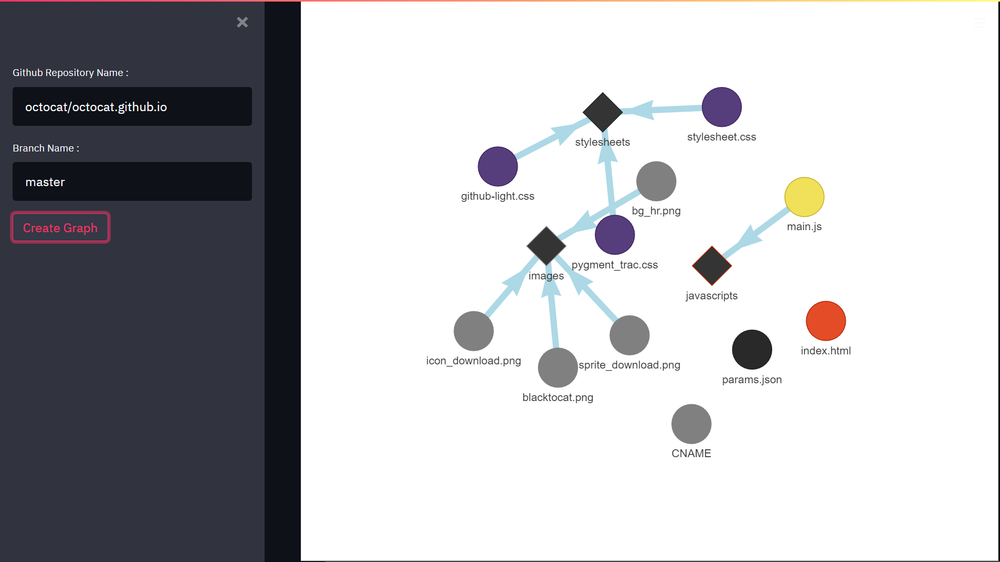

# Network Github

## Goal

Create a network vizualisation of a github repository like this one : [https://octo.github.com/projects/repo-visualization](https://octo.github.com/projects/repo-visualization) within a streamlit app and deploy to heroku.

It use the github API to get the repository data, the pyvis package to create the vizualisation and the streamlit package to create the app.

## Example of the result :

#### Network

#### App

